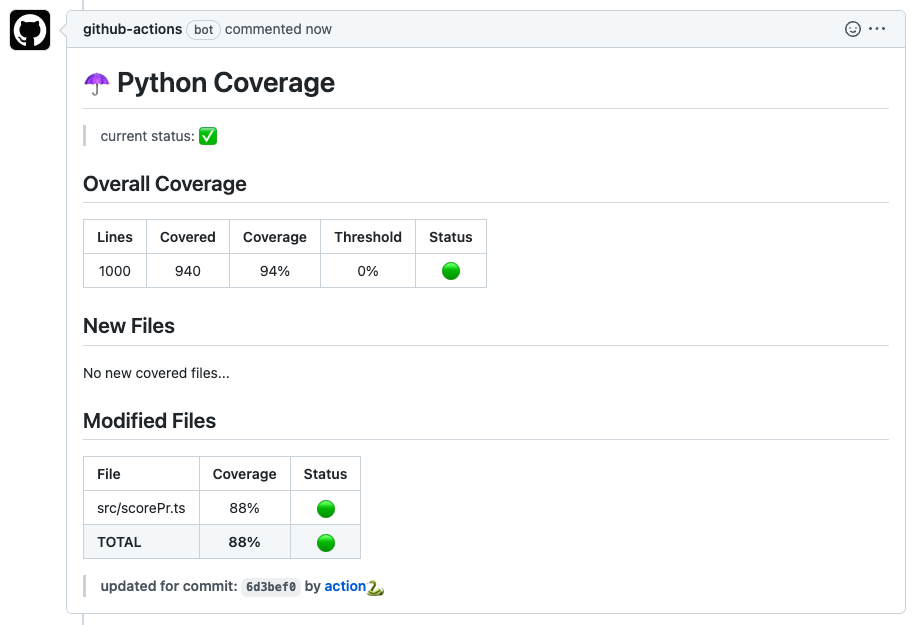

# Python Coverage: The Esential Coverage Reporter GitHub Action for python

> ☂️ parse and publish coverage xml to a PR, enforce coverage rate on new & modified files

## Usage

Create a new workflow `.yml` file in the `.github/workflows/` directory.

You can create a coverage report using python:
 - pytest `$ pytest --cov-report xml:path/to/coverage.xml`
 - coverage `$ coverage xml path/to/coverage.xml`

### Minimal Configuration
```yml
name: 'coverage'
on:
    pull_request:
        branches:
            - master
            - main
jobs:
    coverage:
        runs-on: ubuntu-latest
        steps:
          - name: Get Cover 
            uses: orgoro/coverage@v3.2
            with:
                coverageFile: path/to/coverage.xml
                token: ${{ secrets.GITHUB_TOKEN }}
```

### Advanced Configuration
To allow pull requests from forks, without risking [compromise](https://securitylab.github.com/research/github-actions-preventing-pwn-requests/) of repository secrets, the workflow must be split into two parts.

Coverage Build
```yml
name: Build Coverage

on:
  pull_request:
    branches:
      - main

jobs:
  coverage-build:
    runs-on: ubuntu-latest
    steps:
      - uses: actions/checkout@v4
      - name: Setup Python
        uses: actions/setup-python@v5
        with:
          python-version: "3.11"
      - name: Install coverage
        run: pip install coverage
      - name: Run Coverage
        run: |
          coverage run -m pytest
          coverage xml
      - name: Upload Coverage
        uses: actions/upload-artifact@v4
        with:
          name: coverage.xml
          path: coverage.xml
          retention-days: 1
```

Build report and comment on PR - This *must* exist in the repository's default branch before it can be triggered.
```yml
name: Report Coverage

on:
  workflow_run:
    workflows: ["Build Coverage"]
    types:
      - completed

permissions:
  actions: read
  contents: read
  pull-requests: write

jobs:
  coverage-report:
    runs-on: ubuntu-latest
    if: ${{ github.event.workflow_run.conclusion == 'success' }}
    steps:
      - uses: actions/download-artifact@v4
        with:
          name: coverage.xml
          run-id: ${{ github.event.workflow_run.id }}
          github-token: ${{ secrets.GITHUB_TOKEN }}
      - name: Get Cover
        uses: orgoro/coverage@v3
        with:
            coverageFile: coverage.xml
            token: ${{ secrets.GITHUB_TOKEN }}
```

## PR Message & Job Summary 🆕



## Inputs

| Input               | Optional  | Description                                      | Example                |
|---------------------|-----------|--------------------------------------------------|------------------------|
| `coverageFile`      |           | path to .xml coverage report                     | ./path/to/coverage.xml |
| `token`             |           | your github token                                | 🤫                     |
| `thresholdAll`      | ✅        | the minimal average line coverage                | 0.8                    |
| `thresholdNew`      | ✅        | the minimal average new files line coverage      | 0.9                    |
| `thresholdModified` | ✅        | the minimal average modified files line coverage | 0.0                    |
| `passIcon`          | ✅        | the indicator to use for files that passed       | 🟢                      |
| `failIcon`          | ✅        | the indicator to use for files that failed       | 🔴                      |
| `sourceDir`         | ✅        | the directory to use as the source of the coverage report       | ./path/to/src          |
