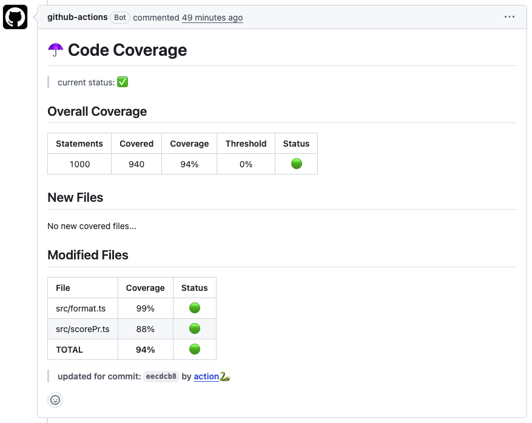

# Python Coverage: The Esential Coverage Reporter GitHub Action for python

> ☂️ parse and publish coverage xml to a PR, enforce coverage rate on new & modified files

## Usage

Create a new workflow `.yml` file in the `.github/workflows/` directory.

You can create a coverage report using python:
 - pytest `$ pytest --cov-report xml:path/to/coverage.xml`
 - coverage `$ coverage xml path/to/coverage.xml`

### Minimal Configuration
```yml
name: 'coverage'
on:
    pull_request:
        branches:
            - master
            - main
permissions:
    contents: read
    pull-requests: write
jobs:
    coverage:
        runs-on: ubuntu-latest
        steps:
          - name: Get Cover 
            uses: orgoro/coverage@v3.2
            with:
                coverageFile: path/to/coverage.xml
                token: ${{ secrets.GITHUB_TOKEN }}
```

### Required Permissions

The action needs `pull-requests: write` to post (and update) the coverage comment, and `contents: read` to fetch the diff between base and head. If your workflow restricts the default token (e.g. via a repo-wide `permissions: read-all`), set them explicitly as shown above.
## PR Message & Job Summary 🆕



## Inputs

| Input               | Optional  | Description                                      | Example                |
|---------------------|-----------|--------------------------------------------------|------------------------|
| `coverageFile`      |           | path to .xml coverage report                     | ./path/to/coverage.xml |
| `token`             |           | your github token                                | 🤫                     |
| `thresholdAll`      | ✅        | the minimal average line coverage                | 0.8                    |
| `thresholdNew`      | ✅        | the minimal average new files line coverage      | 0.9                    |
| `thresholdModified` | ✅        | the minimal average modified files line coverage | 0.0                    |
| `passIcon`          | ✅        | the indicator to use for files that passed       | 🟢                      |
| `failIcon`          | ✅        | the indicator to use for files that failed       | 🔴                      |
| `sourceDir`         | ✅        | the directory to use as the source of the coverage report       | ./path/to/src          |
| `title`             | ✅        | heading text for the PR comment; set a unique value per matrix entry to post separate comments | Python Coverage 3.11   |
